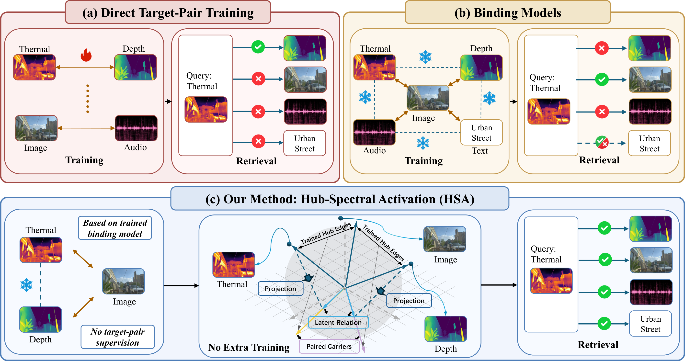
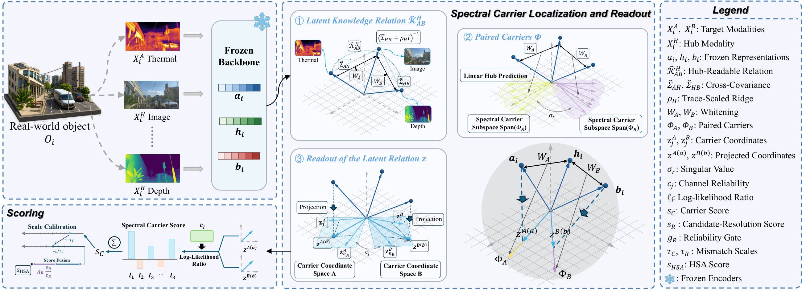

# Latent Multimodal Knowledge via Hub-Spectral Activation

**HSA · Recovering and activating cross-modal relations in frozen representations**

Ying Guo, Haidong Chen, Linrui Xu, Xiaohao Liu, Chuancheng Shi, Canran Xiao, Dan Zhang, Fei Shen, Li Shen, Tat-Seng Chua

**English** | [简体中文](README_zh-CN.md)

[Overview](#overview) · [Method](#method) · [Results](#main-results) · [Release status](#release-status)

## Overview

Hub-based multimodal binding connects different modalities through a shared hub. Although this reduces the need for pairwise supervision, separately trained hub connections do not guarantee reliable alignment between two modalities that were never directly trained together.

**What cross-modal knowledge can be recovered from these two observed hub connections?**

We introduce **Hub-Spectral Activation (HSA)**, a closed-form method that recovers and activates the **hub-readable component of latent multimodal knowledge**. HSA estimates a relation from the second-order statistics of two trained hub edges, locates its paired spectral carriers, and turns their coordinates into scores for bidirectional retrieval and prototype classification.

HSA operates after backbone training, with **frozen encoders, no target-pair supervision, and no gradient optimization**. Its relation fitting and calibration use the observed source hub edges.

## Key ideas

- **A precise recoverability boundary.** Under a second-order source model, we characterize the hub-readable relation, establish conditions for exact recovery of the complete source-induced relation, and bound the dimension of its hub-readable component by the hub covariance rank.
- **Paired spectral carriers.** Leading paired directions express the recovered relation in coordinates that support cross-modal comparison.
- **Reliable task readout.** Reliability-weighted carrier evidence is combined with source-gated candidate resolution and mismatch calibration.
- **One fitted state across tasks.** When encoder coordinates are compatible and evaluation queries do not overlap fitting samples, the same fitted HSA state supports retrieval and prototype classification.

## Method

1. **Recover the relation.** Estimate moments on the two observed hub edges, compose them through the regularized hub covariance, and standardize the resulting cross-modal relation.
2. **Locate the carriers.** Extract paired spectral directions and project frozen target representations into carrier coordinates.
3. **Form the readout.** Combine reliability-weighted matching evidence with a source-gated candidate-resolution score; calibrate their scales using source-derived mismatches.
4. **Score the task.** Rank candidates in either retrieval direction or score class prototypes for classification.

## Main results

Experiments use [ImageBind](https://github.com/facebookresearch/ImageBind) and [LanguageBind](https://github.com/PKU-YuanGroup/LanguageBind).

| Task | Evaluation scope | Frozen cosine | HSA | Gain |
|---|---|---:|---:|---:|
| Bidirectional retrieval | 19 relations; mean Recall@10 | 18.27% | **31.15%** | **+12.88 points** |
| Prototype classification | 11 relations; mean macro Top-1 | 29.01% | **52.43%** | **+23.42 points** |

Retrieval is averaged equally across relations. Classification first averages Top-1 accuracy equally across classes within each relation, then averages equally across relations. The classification results above use the designated classification source features and protocol.

For **exact reuse of the retrieval-fitted state**, eight compatible relations across five datasets have non-overlapping evaluation queries. HSA reaches **48.01%** macro Top-1, compared with **26.46%** for frozen cosine and **48.79%** for separately fitted HSA on those same eight relations.

Controlled correspondence interventions and carrier comparisons identify valid within-edge correspondence and leading paired spectral directions as key sources of the retrieval gain.

## Release status

This initial release contains the project introduction, method overview, and headline results. **Implementation and evaluation code will follow.**

- [x] English and Chinese project descriptions
- [x] Overview and method figures
- [ ] HSA implementation and evaluation scripts
- [ ] Environment setup and data preparation instructions

## Related resources

- [ImageBind](https://github.com/facebookresearch/ImageBind)
- [LanguageBind](https://github.com/PKU-YuanGroup/LanguageBind)

For questions about this project, please open a [GitHub issue](https://github.com/Luo1Yan/HSA/issues).
